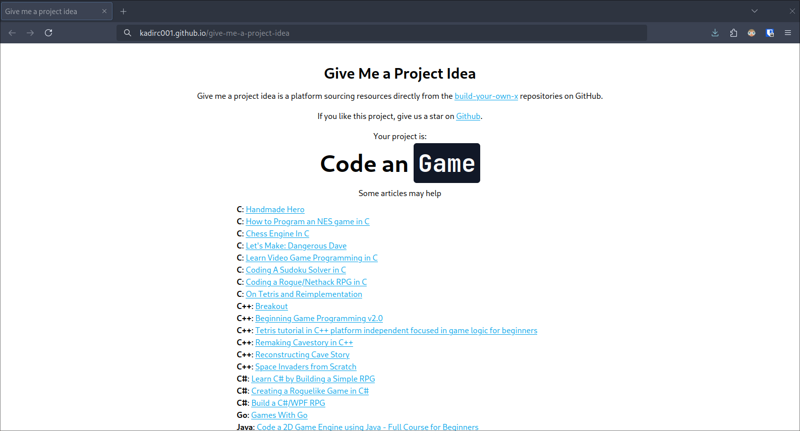

<p align="center">
    
</p>

"Give Me a Project Idea" is a web application designed to inspire developers with creative project ideas. Utilizing React, the application dynamically fetches project ideas and resources from the "build-your-own-x" GitHub repository. It leverages Markdown parsing techniques to extract project headers and related articles, presenting them in a user-friendly interface.

The application randomizes project idea selection on each page load, encouraging exploration and learning across various technology domains. Users can delve into detailed articles associated with each project idea, facilitating in-depth understanding and exploration.

Moreover, the application promotes community engagement by encouraging users to star the GitHub repository. This fosters collaboration and supports open-source projects, empowering developers to contribute and learn within the open-source ecosystem.

"Give Me a Project Idea" serves as a valuable resource for both beginners and experienced developers, fostering creativity and continuous learning by providing curated project ideas and resources.

---

## How it works?

### Schema

```
1. Application Start
   |
   V
2. useEffect() Function Triggered
   |
   V
3. fetchIdea() Function Initiated
   |
   V
4. HTTP Request Sent to "https://raw.githubusercontent.com/codecrafters-io/build-your-own-x/master/README.md"
   |
   V
5. Response Received from Server
   |
   V
6. Text Parsing and Markdown Processing
   - The raw text response from the server is processed using Markdown parsing techniques to extract structured data.
   |
   V
7. Random Project Idea Selected
   - From the parsed data, a random project idea is selected to display to the user.
   |
   V
8. Project Title and Articles List Generated
   - The title and related articles of the selected project idea are extracted and prepared for display.
   |
   V
9. State Updated and UI Refreshed
   - The application state is updated with the selected project idea details, triggering a re-render of the UI to show the new content.
```

### Text

Our project, designed as a React-based web application, initiates by triggering the useEffect hook upon startup, which in turn calls the fetchIdea function. This function sends an HTTP request to fetch the content of the README.md file from the 'build-your-own-x' GitHub repository. Upon receiving the server response, the text undergoes Markdown parsing to extract structured data, specifically the project's title and a list of related articles. These details are then updated in the application state to dynamically refresh the user interface. Each time the page loads, a random project idea is presented, encouraging exploration across various technology domains. This process not only ensures a user-friendly experience with seamless data processing, random selection, and UI updates but also fosters community engagement by prompting users to star the GitHub repository, thereby supporting open-source initiatives.

## Preview



## Development

I use **Bun.js** with **Vite** for this project. But it need to be work without problem in **Node.js**. After starting project, it will be online in [localhost:5173/give-me-a-project-idea](http://localhost:5173/give-me-a-project-idea)

## License

This project is licensed under the GNU General Public License v3.0 - see the [LICENSE](./LICENSE) file for details.

